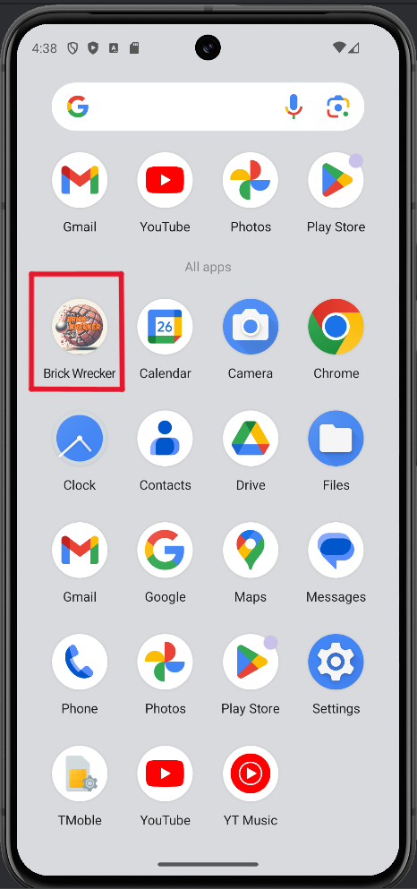
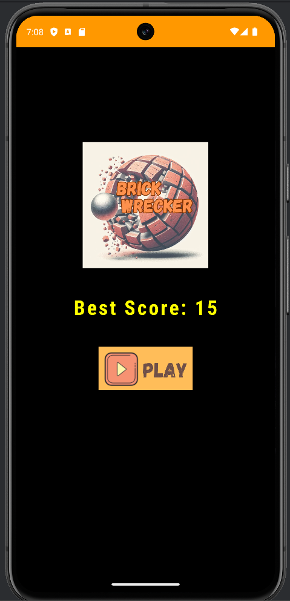
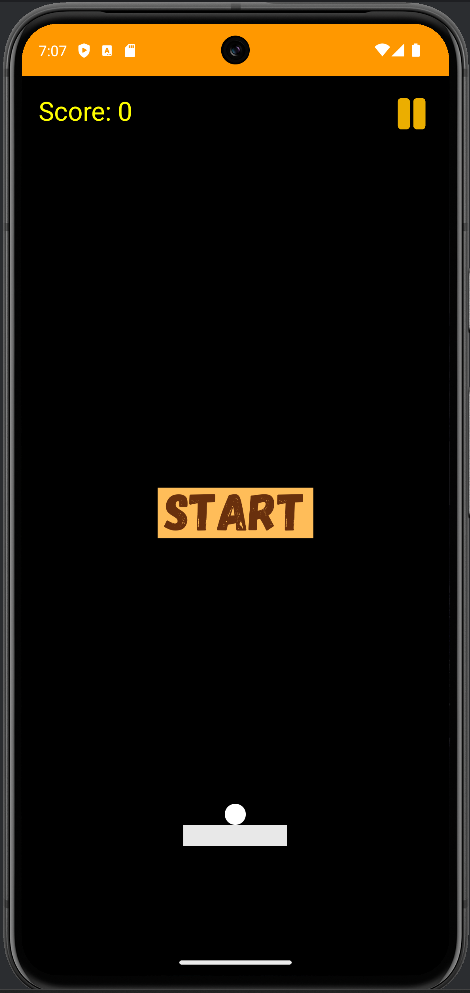
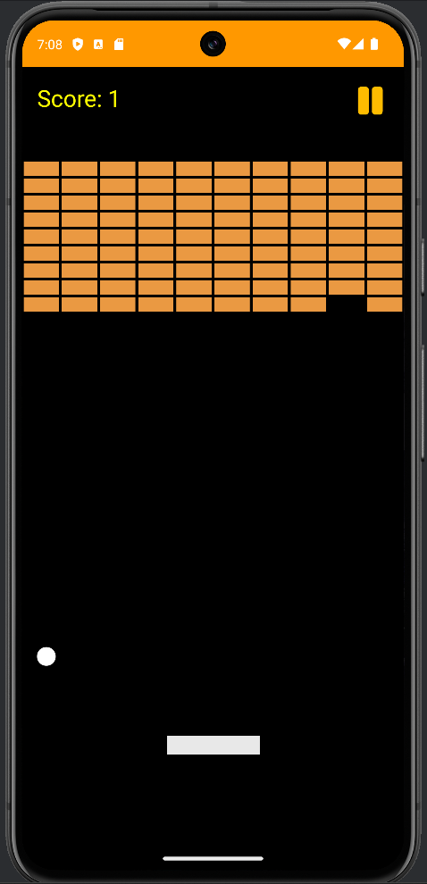
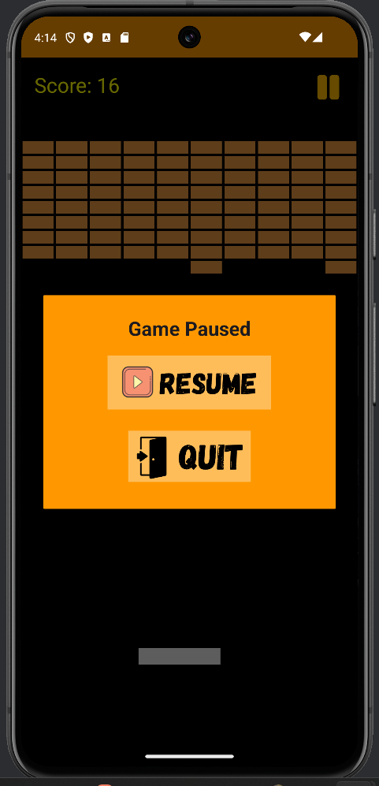
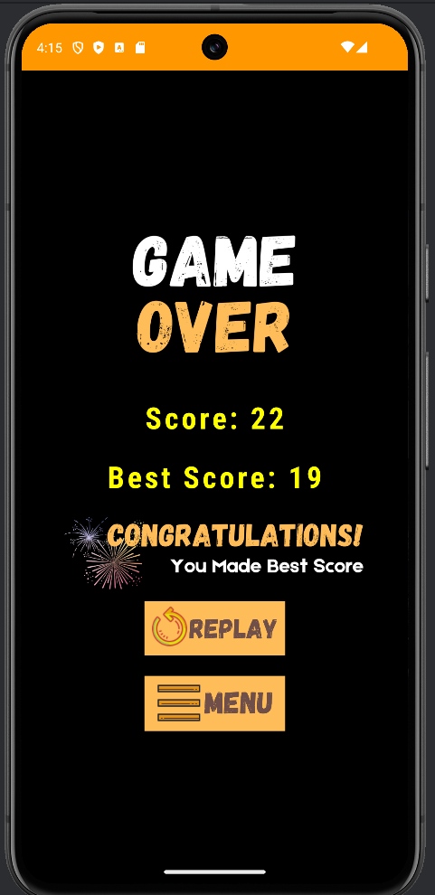

# Brick Wrecker: An Android Game

*Brick Wrecker* is a simple android game that based on old school arcade game which call as brick breaker where players use a metal ball to break bricks. The objective is to score as high as possible by continuously breaking bricks using a paddle at the bottom. Let's dive into the key features:

## Key Features

1. **Game Mechanics:**
   - The game starts with the ball in motion, breaking bricks as it ascends.
   - Players control a horizontal paddle to bounce the ball and keep it in play.
   - Each brick broken adds to the player’s score.

2. **Scoring:**
   - For every brick broken, the player’s score increases by 1.
   - Bonus points are awarded for saving the ball by bouncing it multiple times.

3. **Lives and Speed:**
   - Players have three lives (balls).
   - With each new ball, the speed of the ball increases, adding to the challenge.

4. **Game Over:**
   - If the ball falls below the paddle three times, the game ends.
   - The final score is displayed.

5. **Best Score:**
   - If the player achieves a new high score, it is prominently displayed.

## Instructions

1. Click the **Play** button on the home screen.
2. You’ll be directed to the gameplay screen.
3. Click **Start** to begin the game.
4. Swipe the paddle horizontally to bounce the ball and break as many bricks as possible.
5. If needed, you can pause the game using the pause button in the top right corner.

Enjoy the classic arcade experience of *Brick Wrecker*! 🎮🧱

## Screenshots

### App Gallery

### Main Screen

### Game Play Screen

### Game Playing

### When Paused

### Game Over with Best Score

